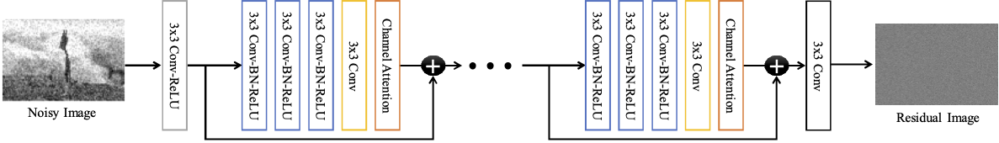

# Locally Adaptive Channel Attention-based Network for Denoising Images (IEEE ACCESS)
[](LICENSE)

[Paper](https://ieeexplore.ieee.org/abstract/document/8999518) | [Bibtex](#Bibtex)


## Dependancy & Requirment
```
python3
pytorch >= 1.3
torchvision >= 0.4.1.
tensorboardX
hdf5
numpy
opencv
```

## Network Architecture


## Train 
```
$ python train.py --preprocess True
```
**NOTE**
* If you've already built the training and validation dataset (i.e. train.h5 & val.h5 files), set *preprocess* to be False.

## Test
```
$ python test.py --test_data Set12 --output_size 10 --test_noiseL 25
```
**NOTE**
* *test_data* can be *Set12* or *Set68* or *Urban100*.
* *output_size* can be any number from 1. Please refer to the paper on this part.
* *test_noiseL* can be *15* or *25* or *50*

## Bibtex
```
@article{lee2020locally,
  title={Locally Adaptive Channel Attention-Based Network for Denoising Images},
  author={Lee, Haeyun and Cho, Sunghyun},
  journal={IEEE Access},
  volume={8},
  pages={34686--34695},
  year={2020},
  publisher={IEEE}
}
```